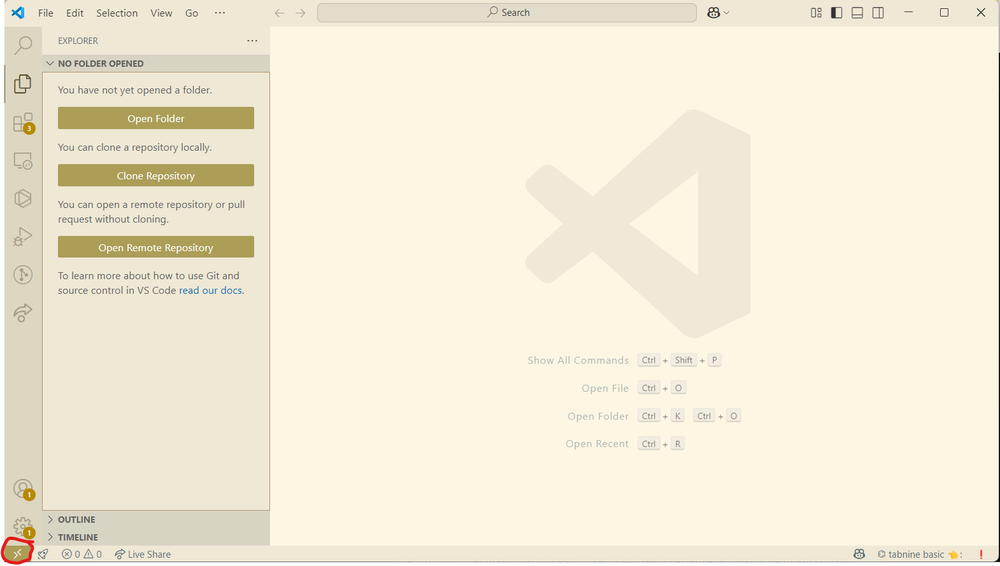

# Formation 2 : environnement de travail

## Objectifs de la formation

À la fin de cette formation, vous serez capable de :

- Installer WSL2 avec Ubuntu 22.04 et vous y connecter depuis VS Code
- Expliquer ce qu'est une image, un conteneur et un volume, et pourquoi l'équipe travaille comme ça
- Installer Docker sur Ubuntu et régler les permissions (groupe `docker`, UID/GID)
- Écrire vos propres Dockerfiles
- Lire et lancer un fichier Docker Compose
- Lancer mavros dans un conteneur et le brancher sur la simulation de la formation 1
- Lire un Makefile et vous en servir comme interface devant Docker

Prérequis : La formation 1 terminé, un poste sous Windows 11 avec les droits administrateur (Windows 10 fonctionne, avec une adresse réseau à adapter, section 1.5), et une trentaine de Go libres.

> [!NOTE]
> **Avant de commencer**
> - **Durée** : environ 3 h, dont vingt minutes de build Docker pendant lesquelles on lit la suite.
> - **Prérequis** : La formation 1 fait (la simulation de Mission Planner démarre et un script Zenmav vole).
> - **À la fin** : mavros roule dans un conteneur et affiche l'état du drone simulé, et une seule commande `make` démarre tout ça.
> - **Aide** : Discord, salon Contrôle, fil « Formations et Questions », avec le message d'erreur exact.
> - **À poster à la fin** : une capture du terminal avec `connected: true` dans `/mavros/state`.

---

## 1 - WSL et Linux

WSL* (Windows Subsystem for Linux) permet de rouler un vrai Linux directement dans Windows, sans machine virtuelle ni dual boot. Tout l'environnement de l'équipe (Docker, ROS 2) roule là-dedans.

*Référence officielle au besoin : <https://learn.microsoft.com/en-us/windows/wsl/install>

> [!NOTE]
> **Linux natif** : sauter la section 1 au complet. Docker s'installe pareil (section 2.3), `127.0.0.1` est vraiment local, et VS Code s'ouvre sans extension Remote. **Mac** : pas de WSL, Docker par Docker Desktop et un réseau hôte limité ; le chemin est décrit dans l'[annexe SITL sans Mission Planner](../ANNEXE-SITL-DOCKER.md), expérimentale.

### 1.1 - Installer WSL et Ubuntu 22.04

**Ubuntu 22.04.** Installer la 22.04 : c'est la version qui va avec ROS 2 Humble, et la seule que l'équipe dépanne. Si une autre version d'Ubuntu est déjà installée dans WSL, la garder : tout roule dans Docker.

Le Microsoft Store n'offre plus la version 22.04 : l'installation se fait donc entièrement par le terminal, pas par le Store.

1. Ouvrir PowerShell en administrateur : clic droit sur le menu Démarrer → Terminal (administrateur).

2. Vérifier que la version 22.04 est offerte :

```powershell
wsl --list --online
```

La liste doit contenir `Ubuntu-22.04` (c'est ce nom exact, avec le tiret, qu'on utilise ensuite).

3. Installer WSL et Ubuntu 22.04 d'un seul coup :

```powershell
wsl --install -d Ubuntu-22.04
```

Cette commande fait tout : elle active les fonctionnalités Windows nécessaires (Virtual Machine Platform et Windows Subsystem for Linux), télécharge le noyau WSL2 et installe Ubuntu 22.04.

4. REBOOT (obligatoire une fois l'installation terminée).

**Si la commande échoue** (fonctionnalités Windows désactivées, vieille installation), les activer manuellement puis réessayer :

```powershell
dism.exe /online /enable-feature /featurename:Microsoft-Windows-Subsystem-Linux /all /norestart
dism.exe /online /enable-feature /featurename:VirtualMachinePlatform /all /norestart
```

Redémarrer, puis :

```powershell
wsl --set-default-version 2
wsl --install -d Ubuntu-22.04
```

### 1.2 - Premier démarrage d'Ubuntu

Après le redémarrage, Ubuntu ouvre un terminal et termine son installation. S'il ne s'ouvre pas tout seul, chercher « Ubuntu 22.04 » dans le menu Démarrer.

Ubuntu demande ensuite de créer un username (en minuscules, sans espaces) et un mot de passe.

> [!NOTE]
> Les caractères du mot de passe ne s'affichent pas sur Linux : aucun retour visuel pendant la saisie, c'est normal.

Une fois dans le terminal Ubuntu, mettre le système à jour :

```bash
sudo apt update && sudo apt upgrade -y
```

### 1.3 - Vérifications

Dans PowerShell (pas dans Ubuntu) :

```powershell
wsl -l -v
```

Résultat attendu : `Ubuntu-22.04` avec `VERSION 2`.

- Si la version affichée est 1 : `wsl --set-version Ubuntu-22.04 2`
- Si plusieurs distros sont installées, définir 22.04 comme défaut : `wsl --set-default Ubuntu-22.04`

Dans le terminal Ubuntu, vérifier la version exacte :

```bash
lsb_release -a
```

Doit afficher Ubuntu 22.04.x LTS.

> [!TIP]
> **Tu as réussi si** `wsl -l -v` montre `Ubuntu-22.04` en version 2 et que `lsb_release -a` affiche 22.04.

### 1.4 - WSL dans VS Code

Installer WSL à partir de l'onglet extension :


Cliquer sur les flèches en bas à gauche → Connect to WSL using Distro… → Ubuntu-22.04 (déjà installé à l'étape 1.1, il apparaît dans la liste) :



VS Code redémarre connecté à Ubuntu : la mention « WSL: Ubuntu-22.04 » apparaît en bas à gauche et le terminal intégré (Terminal → New Terminal) ouvre maintenant un shell Ubuntu.

Ouvrir votre « home » en cliquant sur File → Open Folder → Ok.

Pour sortir de l'environnement Linux, recliquer les flèches en bas → choisir Close Remote Connection :


Pour revenir dans Ubuntu plus tard : les flèches en bas à gauche, ou File → Open Recent (les dossiers WSL y restent listés).

> [!TIP]
> **Tu as réussi si** le terminal intégré de VS Code affiche une invite Ubuntu (`nom@machine:~$`) et que `pwd` répond `/home/nom`.

### 1.5 - Le réseau : mode Mirrored

Sous WSL2, l'hôte des programmes Linux n'est pas Windows mais une machine virtuelle. Par défaut, elle a sa propre adresse, et `127.0.0.1` vu de WSL n'est pas le `127.0.0.1` de Windows : un programme Linux ne peut pas joindre la simulation de Mission Planner à cette adresse. Le mode **Mirrored** de WSL fait partager à la machine virtuelle les adresses de Windows, et tout le texte de la formation 2 et de la formation 3 suppose ce mode.

Il demande Windows 11 (22H2 ou plus récent). Pour l'activer : ouvrir l'application **WSL Settings** (menu Démarrer), section **Networking**, régler **Networking mode** sur **Mirrored**. Puis redémarrer WSL depuis PowerShell :

```powershell
wsl --shutdown
```

Vérification, dans le terminal Ubuntu, avec la simulation de la formation 1 démarrée (elle écoute sur le port 5762) :

```bash
timeout 2 bash -c '</dev/tcp/127.0.0.1/5762' && echo "Mirrored OK"
```

> [!TIP]
> **Tu as réussi si** la commande affiche « Mirrored OK ». Sinon, vérifier le réglage, refaire `wsl --shutdown`, et vérifier que la simulation est bien démarrée dans MP.

> [!NOTE]
> **Windows 10** : le mode Mirrored n'existe pas. Trouver l'adresse de Windows vue de WSL avec `ip route show default | awk '{print $3}'` (par exemple `172.20.16.1`) et la donner partout où le texte dit `127.0.0.1` : `Zenmav('tcp:172.20.16.1:5763')` dans la formation 2, `make mavros FCU_HOST=172.20.16.1` dans les formations 2 et 3. L'adresse peut changer à chaque redémarrage de WSL.


## 2 - Docker

### 2.1 - Pourquoi Docker

Docker permet d'empaqueter une application avec tout ce dont elle a besoin (le code, les librairies, les outils système) dans une unité portable appelée conteneur*. Ce conteneur roule de la même façon partout : sur votre portable, sur celui de votre coéquipier, sur l'ordinateur de Zenith, sur un Jetson.

*Un **conteneur** est un environnement isolé qui contient sa propre version de Linux et de ses librairies, mais qui partage le noyau de la machine hôte.

Pourquoi ne pas simplement tout installer normalement? Parce qu'une installation manuelle finit toujours par diverger. Une personne a Python 3.10, l'autre 3.12, une troisième a une vieille version de mavros installée à la main, et le code arrête de marcher sans que personne comprenne pourquoi. Docker règle le classique « moi ça marche sur ma machine » : si ça marche dans le conteneur, ça marche pour tout le monde.

En contrôle, c'est encore plus utile qu'ailleurs. Le code et son environnement sont partagés entre plusieurs développeurs, sur leurs ordinateurs personnels et sur l'ordinateur de l'équipe. En plus, il faut déployer exactement le même environnement sur les ordinateurs embarqués du drone, Jetson ou Raspberry Pi. Ça fait beaucoup de plateformes à garder synchronisées, et le conteneur est ce qui rend la chose possible.

Certains d'entre vous ont peut-être déjà entendu parler de machines virtuelles (VM). Un conteneur remplit un rôle semblable, mais il est beaucoup plus léger : il ne transporte pas un système d'exploitation complet, il réutilise celui de la machine hôte. Une VM démarre en une minute et pèse des dizaines de gigaoctets, un conteneur démarre en une seconde.

- Docker : un ninja léger
- VM : un gros tank

### 2.2 - Images, conteneurs et volumes

On entend souvent « image » et « conteneur » utilisés comme des synonymes. Ce n'en sont pas, et comprendre la différence est exactement ce qui sépare quelqu'un qui copie-colle des commandes de quelqu'un qui sait ce qu'il fait.

**Une image** est une recette. C'est un fichier en lecture seule qui contient tout ce dont l'application a besoin : le code, l'interpréteur, les dépendances, les variables d'environnement. Une image ne roule pas plus qu'une recette ne se mange.

**Un conteneur** est une instance en train de rouler d'une image. C'est l'application vivante, qui fait réellement quelque chose.

| Concept | Analogie |
|---|---|
| Image | les instructions, le disque de jeu |
| Conteneur | l'application qui roule, la partie en cours sur la console |

On peut créer autant de conteneurs qu'on veut à partir d'une seule image, comme on peut jouer au même jeu sur plusieurs consoles. Un conteneur est jetable : quand on le supprime, tout ce qui a été écrit dedans disparaît avec lui.

**Un volume** est la réponse à ça. C'est un dossier de la machine hôte rendu visible à l'intérieur du conteneur. Ce qui est écrit dedans survit au conteneur, et les modifications passent dans les deux sens : on édite un fichier dans VS Code, le conteneur voit le changement immédiatement. C'est comme ça qu'on travaille au quotidien.

### 2.3 - Installer Docker sur Ubuntu

L'installation passe par le script officiel de Docker : il détecte la distribution, ajoute le dépôt Docker et installe le moteur, la ligne de commande et Compose. Docker le déconseille pour un serveur de production, où l'on veut contrôler chaque réglage ; pour un poste de développement, c'est exactement ce qu'il faut. (La méthode par dépôt apt, étape par étape, est dans le guide officiel, <https://docs.docker.com/engine/install/ubuntu/>, pour qui préfère tout faire à la main.) **Tout se fait dans le terminal Ubuntu**, pas dans PowerShell.

> [!NOTE]
> On installe Docker Engine directement dans WSL, pas Docker Desktop. C'est la même chose que ce qui roule sur le Jetson, ça évite une couche d'intégration supplémentaire.

1. Lancer le script :

```bash
curl -fsSL https://get.docker.com | sh
```

Sous WSL, il affiche un avertissement « WSL DETECTED » qui recommande Docker Desktop, puis attend vingt secondes avant de continuer : l'ignorer. Le tout prend une ou deux minutes.

2. Vérifier que Docker fonctionne :

```bash
sudo docker run hello-world
```

Cette commande télécharge une petite image de test et lance un conteneur. Le conteneur affiche quelques lignes confirmant que l'installation est bonne, puis se termine.

#### Permissions : le groupe docker

Pour l'instant, Docker ne répond qu'avec `sudo`. On règle ça en s'ajoutant au groupe `docker` :

```bash
# Créer le groupe docker (s'il n'existe pas déjà)
sudo groupadd docker

# Ajouter votre utilisateur au groupe
sudo usermod -aG docker $USER
```

> [!WARNING]
> **Piège classique** : la commande réussit, mais rien ne change. L'appartenance à un groupe n'est lue qu'à l'ouverture de la session, il faut donc redémarrer WSL au complet. Fermer la connexion dans VS Code (les flèches en bas à gauche, Close Remote Connection), puis dans PowerShell :
>
> ```powershell
> wsl --shutdown
> ```

Rouvrir WSL, et vérifier que ça marche sans `sudo` :

```bash
docker run hello-world
```

> [!TIP]
> **Tu as réussi si** « Hello from Docker! » s'affiche sans `sudo`.

### 2.4 - Commandes de survie

| Commande | Ce qu'elle fait |
|---|---|
| `docker ps` | Liste les conteneurs en train de rouler (`-a` pour voir aussi les arrêtés) |
| `docker images` | Liste les images présentes sur la machine |
| `docker build -t <nom> .` | Bâtit une image à partir du Dockerfile du dossier courant |
| `docker run <image>` | Crée un conteneur à partir d'une image et le démarre |
| `docker exec -it <id> bash` | Ouvre un shell dans un conteneur déjà en train de rouler |
| `docker logs -f <id>` | Affiche la sortie d'un conteneur, `-f` pour suivre en direct |
| `docker stop <id>` | Arrête un conteneur |
| `docker rm <id>` | Supprime un conteneur arrêté |
| `docker rmi <image-id>` | Supprime une image |
| `docker system df` | Montre l'espace disque occupé par Docker |
| `docker system prune` | Fait le ménage dans ce qui ne sert plus |

L'`<id>` peut toujours être remplacé par le nom du conteneur, plus facile à retenir, et les identifiants s'abrègent aux premiers caractères tant qu'ils restent uniques.

> [!WARNING]
> **Piège** : les images ROS 2 pèsent plusieurs gigaoctets chacune. Après quelques semaines, `docker system df` réserve des surprises. Prenez l'habitude d'arrêter vos conteneurs en fin de séance (`docker stop`).

### 2.5 - Écrire un Dockerfile

Un Dockerfile est la recette de l'image : une suite d'instructions exécutées de haut en bas, chacune produisant une couche* de l'image finale.

*Une **couche** est la différence entre l'état de l'image avant et après une instruction. Docker les garde en cache : si une instruction et toutes celles qui la précèdent sont inchangées, il réutilise la couche au lieu de la refaire. C'est pour ça qu'on place ce qui change rarement (installer des paquets) en haut du fichier, et quand on veut tester une modification rapide :  on la met en bas du dockerfile.

Les instructions à connaître :

| Instruction | Rôle |
|---|---|
| `FROM` | Image de départ. Toujours la première instruction |
| `ARG` | Variable disponible pendant le build seulement |
| `ENV` | Variable d'environnement, présente aussi dans le conteneur qui roule |
| `RUN` | Exécute une commande pendant le build (installer, compiler, télécharger) |
| `WORKDIR` | Dossier courant pour les instructions suivantes et pour le conteneur |
| `COPY` | Copie des fichiers de la machine vers l'image |
| `USER` | Utilisateur sous lequel roule la suite |
| `EXPOSE` | Documente le port utilisé. N'ouvre rien par lui-même |
| `CMD` | Commande lancée au démarrage du conteneur, remplaçable au `docker run` |

#### Un premier Dockerfile

Dans votre home Ubuntu (pas dans `/mnt/c`), créer un dossier `demo-docker` avec trois fichiers. (Les mêmes fichiers sont dans le dossier [first_docker](first_docker) de la formation, pour comparer.)

`app.py` :

```python
print("Hello depuis le conteneur")
```

`index.html` :

```html
<h1>Zenith, formation 2</h1>
```

`Dockerfile` (sans extension, avec le D majuscule) :

```dockerfile
# Image de base : Python 3.11 sur une Debian minimale
FROM python:3.11-slim

# Dossier de travail dans l'image
WORKDIR /app

# Copie du contenu du dossier courant vers /app dans l'image
COPY . .

# Commande lancée par défaut au démarrage d'un conteneur
CMD ["python3", "app.py"]
```

Bâtir l'image, puis lancer un conteneur :

```bash
cd ~/demo-docker
docker build -t demo-b2 .
docker run --rm demo-b2
```

Le `-t demo-b2` donne un nom à l'image, le `.` désigne le contexte de build (le dossier envoyé à Docker, ici le dossier courant). Le `--rm` supprime le conteneur dès qu'il se termine, ce qui évite d'accumuler des conteneurs morts.

Résultat attendu : `Hello depuis le conteneur`.

Maintenant, la même image avec une autre commande :

```bash
docker run --rm -p 8000:8000 demo-b2 python3 -m http.server 8000
```

Tout ce qui suit le nom de l'image remplace le `CMD` du Dockerfile. Le `-p 8000:8000` publie le port 8000 du conteneur sur le port 8000 de la machine. Ouvrir <http://localhost:8000> dans un navigateur Windows : la page apparaît, WSL2 s'occupant tout seul de rediriger `localhost`. `Ctrl+C` arrête le conteneur.

Une seule image, deux conteneurs, deux comportements. C'est la différence image / conteneur de la section 2.2, en pratique.

> [!TIP]
> **Tu as réussi si** « Hello depuis le conteneur » s'affiche dans le terminal, puis la page « Zenith, formation 2 » dans le navigateur Windows.

#### COPY ou volume

Le Dockerfile ci-dessus fige le code dans l'image avec `COPY`. Changer une ligne d'`app.py` oblige donc à rebâtir l'image, ce qui est insupportable en développement.

La solution est de monter le dossier plutôt que de le copier :

```bash
docker run --rm -v $(pwd):/app demo-b2
```

Le `-v <dossier hôte>:<dossier conteneur>` monte le dossier courant sur `/app` dans le conteneur, en remplaçant ce qui s'y trouvait. Modifier `app.py`, relancer la commande : le changement est pris en compte sans rebâtir quoi que ce soit.

La règle de l'équipe :

- **En développement** : le code est monté par un volume. On édite dans VS Code, le conteneur voit tout de suite.
- **Au final**: Le code pourrait être copié pour faire une image plus propre. En pratique, on est toujours en développement, donc déconseillé de copié le code sauf si complètement fonctionnel et non dédié à la modification.

#### Un Dockerfile standard de l'équipe

Voici un exemple représentatif de ce qui roule chez Zenith : une image ROS 2 Humble avec mavros, prête à recevoir un workspace monté en volume. Le fichier est dans [docker/dockerfile.example](docker/dockerfile.example), et chaque ligne y est commentée : l'ouvrir dans VS Code et le lire de haut en bas avant de continuer, le texte ne le recopie pas.

Trois points méritent qu'on s'y attarde.

**Le cache de couches.** Les `RUN apt-get` sont en haut parce qu'ils ne changent presque jamais. Tant que ces lignes ne bougent pas, un rebuild saute directement à la fin, et on passe de vingt minutes à quelques secondes. Une ligne modifiée invalide sa couche et toutes celles d'en dessous.

**L'utilisateur non root.** C'est le piège numéro un des nouveaux. Par défaut, un conteneur roule en root, donc tout fichier qu'il crée dans un volume monté appartient à root sur votre machine. Vous vous retrouvez avec un dossier de build que vous ne pouvez plus supprimer et des erreurs de permission incompréhensibles. Créer un utilisateur qui porte votre UID règle le problème à la source. Si le mal est déjà fait :

```bash
sudo chown -R $USER:$USER <dossier>
```

**Le groupe dialout.** Sans lui, le conteneur ne peut pas ouvrir `/dev/ttyUSB0` et mavros ne parle pas au contrôleur de vol quand le drone est branché en USB.

### 2.6 - Docker Compose

Une commande `docker run` complète, avec ses volumes, ses ports, ses variables d'environnement et son utilisateur, fait dix lignes que personne ne veut retaper, voir le lancement du deuxième conteneur html un peu plus haut. Docker Compose met tout ça dans un fichier YAML versionné avec le code, et lance le tout avec une commande courte et structurée. C'est aussi ce qui permet de démarrer plusieurs conteneurs liés d'un seul coup, ce qui est souvent le cas d'un stack de vol (mavros, la mission, la caméra, le relais réseau). En bref, le lancement d'un compose est beaucoup plus propre.

Le fichier [compose/example.yaml](compose/example.yaml) définit deux services bâtis sur le Dockerfile de la section précédente. Le premier, `example`, est le conteneur de travail :

```yaml
# Fichier Compose de la formation 2 : deux services bâtis sur la même image.
#   example   le conteneur de travail, qui dort en attendant qu'on entre dedans
#   mavros    mavros branché sur la simulation, dans son propre conteneur

# Nom du projet Compose. Sans lui, Compose prend le nom du dossier qui contient ce
# fichier (compose). Il préfixe le nom de l'image et des conteneurs.
name: b2

services:
  # Nom du service. C'est le nom qu'on passe aux commandes compose
  # (docker compose up example, docker compose logs example) et le nom d'hôte
  # du conteneur pour les autres services du même fichier.
  example:

    build:

      # Dossier envoyé au démon Docker comme contexte de build : c'est la racine
      # de tout ce que le Dockerfile peut copier. Relatif à CE fichier, donc la formation 2.
      context: ..

      # Chemin du Dockerfile, relatif au contexte.
      dockerfile: docker/dockerfile.example

    # Nom fixe de l'image bâtie. Le service mavros réutilise la même image :
    # une seule image sur le disque, bâtie une seule fois.
    image: b2-example

    # Nom fixe du conteneur au lieu du nom généré (b2-example-1). Rend les
    # commandes prévisibles : docker exec -it example bash
    container_name: example

    # Le conteneur partage la pile réseau de la machine hôte : aucun port à
    # rediriger, et la découverte DDS de ROS 2 fonctionne sans configuration.
    network_mode: host

    # Alloue un pseudo-terminal, équivalent du -t de docker run.
    tty: true

    # Garde l'entrée standard ouverte, équivalent du -i. Les deux ensemble = -it
    stdin_open: true

    volumes:
      # Montage : le dossier de gauche (sur l'hôte, relatif à ce fichier) apparaît
      # dans le conteneur au chemin de droite. Les modifications passent dans les
      # deux sens et survivent à la suppression du conteneur.
      - ../example_ws:/example_ws

    # Dossier au démarrage du conteneur. Les chemins relatifs dans le CMD ou les
    # scripts sont relatifs à ce dossier.
    working_dir: /example_ws

    # Remplace le CMD de l'image. Ici le conteneur ne fait rien et reste en vie,
    # pour qu'on puisse entrer dedans quand on veut avec docker exec.
    command: ["bash", "-lc", "while :; do sleep 86400; done"]

    # Réseautique et DDS : important, mais couvert dans une autre formation.
    environment:
      - ROS_DOMAIN_ID=2
      - RMW_IMPLEMENTATION=rmw_cyclonedds_cpp
      - ROS_AUTOMATIC_DISCOVERY_RANGE=LOCALHOST
```

Le même fichier définit un deuxième service, `mavros`, sur la même image :

```yaml
  mavros:
    build:
      context: ..
      dockerfile: docker/dockerfile.example
    image: b2-example
    container_name: mavros
    network_mode: host
    environment:
      - ROS_DOMAIN_ID=2
      - RMW_IMPLEMENTATION=rmw_cyclonedds_cpp
      - ROS_AUTOMATIC_DISCOVERY_RANGE=LOCALHOST
    command: ["bash", "-lc", "source /opt/ros/humble/setup.bash && ros2 launch mavros apm.launch fcu_url:=${FCU_URL:-tcp://127.0.0.1:5762} fcu_protocol:=v2.0"]
```

Même image, même réseau, mêmes variables, mais un `command` qui lance mavros au lieu de dormir, et pas de volume : ce conteneur n'a rien à lire dans `example_ws`. `${FCU_URL:-...}` est une substitution de Compose : la variable d'environnement `FCU_URL` du terminal si elle existe, sinon la valeur écrite après `:-`. C'est le Makefile de la section 2.8 qui s'en sert ; à la section 2.7, on lance d'abord mavros à la main, pour voir ce que ce service automatise.

Détails importants.

**Le réseau en mode host.** Le conteneur partage la pile réseau de la machine WSL, donc les adresses de Windows quand WSL est en mode Mirrored (section 1.5) : `127.0.0.1:5762` joint la simulation de Mission Planner depuis le conteneur sans rien configurer.

**Le conteneur qui dort.** Le `command` ne lance pas d'application : il boucle sur des `sleep` pour garder le conteneur en vie. C'est le canevas de développement. On le démarre en début de séance, on entre dedans avec `docker exec` quand on en a besoin, on lance ses commandes ROS 2 à la main, et on l'arrête à la fin. Oui, enchaîner `docker compose build`, `up`, `exec`, les commandes ROS 2 puis `down` est long et chiant. On va quand même le faire une fois au complet, à des fins de pédagogie, et le raccourci vient juste après.

### 2.7 - Le tour complet, à la main

On a les trois pièces : une image (2.5), un fichier Compose qui la lance (2.6) et la simulation de la formation 1. On les fait servir ensemble une fois, du début à la fin. Objectif : voir un message ROS 2 sortir du conteneur pendant que le drone simulé vole sous Windows.

**1. Démarrer la simulation.** Dans Mission Planner, onglet **Simulation**, **Multirotor** en version **Stable** (procédure détaillée dans la formation 1, section 1.2). Attendre que la connexion s'établisse, puis laisser MP ouvert pour tout le reste de la section.

Le SITL démarré par MP publie sa liaison MAVLink sur deux ports TCP locaux en plus de celui que MP utilise pour lui-même : `5762` et `5763`. C'est sur le 5762 qu'on branche mavros, le même que Zenmav prenait par défaut dans la formation 1.

**2. Vérifier le réseau WSL.** En mode Mirrored (section 1.5), le conteneur joint la simulation à `127.0.0.1` et il n'y a rien à faire. Sous Windows 10, garder sous la main l'adresse de Windows vue de WSL (section 1.5) et l'utiliser partout où le texte dit `127.0.0.1`.

**3. Bâtir l'image.** Depuis le dossier `2-environnement` de la formation, qui doit être dans votre home WSL et non dans `/mnt/c`. Adapter le chemin à l'endroit où vous avez cloné la formation :

```bash
cd ~/Formations-Controle/2-environnement
mkdir -p example_ws
docker compose -f compose/example.yaml build
```

Le `mkdir` sert à créer le dossier monté en volume avant Docker : si le dossier n'existe pas au démarrage, c'est le démon Docker qui le crée, et il appartient alors à root (le problème de propriétaire de la section 2.5).

Le premier build prend de dix à vingt minutes : ROS 2, mavros et les données de géoïde se téléchargent. Les suivants durent quelques secondes grâce au cache de couches.

**4. Démarrer le conteneur.**

```bash
docker compose -f compose/example.yaml up -d example
```

Le `-d` (détaché) rend la main tout de suite. Le nom du service à la fin compte : sans lui, Compose démarrerait aussi `mavros`, qu'on veut lancer à la main à l'étape 7 pour cette fois. `docker ps` montre le conteneur `example` en train de rouler : il ne fait rien, il dort, comme prévu par le `command` du fichier Compose.

**5. Entrer dedans.**

```bash
docker compose -f compose/example.yaml exec example bash
```


**6. Sourcer ROS 2.**

```bash
source /opt/ros/humble/setup.bash
```

> [!WARNING]
> **Piège** : sans cette ligne, la commande `ros2` n'existe pas (`command not found`). Les images ROS officielles sourcent leur environnement dans un entrypoint, et `docker exec` ne passe pas par l'entrypoint. Il faut donc le faire à la main dans chaque shell ouvert de cette façon.

**7. Lancer mavros.**

```bash
ros2 launch mavros apm.launch fcu_url:=tcp://127.0.0.1:5762 fcu_protocol:=v2.0
```

`apm.launch` est le fichier de lancement pour ArduPilot (il existe un `px4.launch` pour PX4). `fcu_url` dit à mavros comment joindre l'autopilote : ici en TCP vers la simulation, alors qu'en vol le Jetson utilise le port série (`serial:///dev/ttyTHS1:921600`, voir, au besoin, `compose/mavros.yml` du dépôt aeac-2026).

Le lancement affiche beaucoup de lignes. Celle qui compte :

```
[mavros_node-1] [INFO] [...]: CON: Got HEARTBEAT, connected. FCU: ArduPilot
```

Laisser rouler, ce terminal est occupé.

**8. Lire le message de statut, dans un deuxième terminal.** Ouvrir un nouveau terminal WSL, retourner dans `2-environnement`, et entrer dans le même conteneur :

```bash
docker compose -f compose/example.yaml exec example bash

```
```bash
source /opt/ros/humble/setup.bash
ros2 topic echo /mavros/state
```


Un bloc apparaît environ une fois par seconde :

```yaml
header:
  stamp:
    sec: 1757...
    nanosec: ...
  frame_id: ''
connected: true
armed: false
guided: false
manual_input: true
mode: STABILIZE
system_status: 3
```

`connected: true` est la preuve que la chaîne complète fonctionne : Mission Planner, SITL, TCP, WSL, conteneur, mavros, topic ROS 2. Pour la voir bouger, changer le mode de vol dans MP (Set Mode vers GUIDED, section 1.3 de la formation 1) et regarder le champ `mode:` changer dans le terminal. Armer le drone dans MP fait passer `armed:` à `true`.

> [!TIP]
> **Tu as réussi si** `connected: true` s'affiche et que `mode:` change quand vous changez de mode dans MP. C'est la capture à poster pour la formation 2.

**9. Tout arrêter.** `Ctrl+C` pour couper l'écoute, `exit` pour sortir du conteneur. Même chose dans le premier terminal pour mavros. Puis :

```bash
docker compose -f compose/example.yaml down
docker ps -a
```

`down` arrête et supprime le conteneur. `docker ps -a` ne doit plus contenir `example`. Le contenu de `example_ws` reste sur votre machine : c'est tout l'intérêt du volume.

Le compte final : neuf étapes, deux terminaux, six commandes à retaper à chaque séance, dont deux qui font trois lignes. Personne dans l'équipe ne travaille comme ça.

### 2.8 - Make : une commande au lieu de six

**Ce qu'est make.** Un outil de 1976 conçu pour compiler du C : on lui décrit quels fichiers dépendent de quels autres, et il ne refait que ce qui doit l'être. L'équipe s'en sert surtout pour son deuxième usage, beaucoup plus répandu aujourd'hui : un lanceur de commandes, documenté et versionné avec le code. C'est le seul endroit où vivent les longues lignes `docker compose`, et personne n'a besoin de les connaître par cœur.

**L'anatomie d'une règle.**

```makefile
cible: dépendances
<TAB>commande
<TAB>autre commande
```

`make cible` roule d'abord les recettes des dépendances, puis la sienne. `make` sans argument roule la première cible du fichier.

**Les cinq règles à connaître.**

1. **Une tabulation, pas des espaces**, devant chaque commande. C'est le piège numéro un et l'erreur est cryptique : `Makefile:12: *** missing separator. Stop.` Dans VS Code, ajouter `"[makefile]": { "editor.insertSpaces": false }` aux settings règle le problème une fois pour toutes.
2. **Chaque ligne de recette roule dans son propre shell.** Un `cd` fait sur une ligne est oublié à la suivante. Pour enchaîner, on met tout sur une ligne logique avec `&&` et on continue avec `\` en fin de ligne.
3. **Les variables.** `:=` évalue tout de suite, une seule fois. `?=` n'affecte que si la variable n'existe pas déjà, ce qui la rend surchargeable depuis la ligne de commande : `make mavros TCP_PORT=5763`. On lit une variable avec `$(NOM)`.
4. **Les préfixes.** `@` devant une commande empêche make de l'afficher avant de la rouler (utile pour les `echo`). `-` devant une commande fait continuer make même si elle échoue.
5. **`.PHONY`** liste les cibles qui ne produisent pas de fichier portant leur nom. Sans ça, un fichier nommé `shell` dans le dossier ferait dire à make que la cible `shell` est déjà à jour, et il ne ferait rien.

**Le Makefile de la formation.** Le fichier [Makefile](Makefile) est dans le dossier `2-environnement`, commenté ligne par ligne : c'est lui qu'il faut lire, le texte n'en reprend que ce qui mérite une explication. Il fait en une commande tout le tour de la section 2.7 :

| Cible | Ce qu'elle fait |
|---|---|
| `make build` | Bâtit l'image (`docker compose build`) |
| `make shell` | Démarre le conteneur de travail s'il ne roule pas, puis ouvre un shell dedans, ROS 2 sourcé |
| `make mavros` | Démarre mavros dans son propre conteneur, branché sur la simulation |
| `make mavros-logs` | Suit les logs de mavros ; la ligne `Got HEARTBEAT` confirme la connexion |
| `make listen-status` | Démarre mavros et affiche `/mavros/state` |
| `make down` | Arrête et supprime les conteneurs |

Trois choses à remarquer.

**La dépendance `shell: up`.** `up` roule avant `shell`, à chaque fois. Comme `docker compose up -d` ne fait rien quand le conteneur roule déjà, `make shell` se tape sans risque dans autant de terminaux qu'on veut : le premier démarre le conteneur, les suivants ouvrent juste un shell de plus. Rien ne s'arrête quand on sort d'un shell ; c'est `make down` qui range, en fin de séance.

**Le `exec bash -i` de la cible `shell`.** Le `bash -lc` qui source ROS 2 est un shell non interactif ; le `exec bash -i` le remplace ensuite par un shell interactif qui hérite de l'environnement. Sans ça, vous vous retrouveriez dans un shell où `ros2` n'existe pas, soit exactement le piège de l'étape 6.

**mavros dans son propre conteneur.** À l'étape 7, mavros occupait un terminal entier. Le Makefile le lance plutôt comme deuxième service du fichier Compose (`make mavros`, soit `docker compose up -d mavros`), dans un conteneur à lui, bâti sur la même image. Un processus par conteneur : on le démarre, on lit ses logs (`make mavros-logs`), `make down` l'arrête avec le reste, et le relancer deux fois ne crée jamais deux mavros. C'est exactement ce que fait `compose/mavros.yml` dans aeac-2026. `FCU_URL` lui arrive par l'environnement : `make mavros FCU_HOST=172.20.16.1` pour un WSL sans mode Mirrored, `make mavros TCP_PORT=5763` pour l'autre port du SITL.

Les commentaires `##` à côté des cibles ne servent à rien ici, mais le Makefile d'aeac-2026 a une cible `help` qui les lit pour afficher la liste des cibles documentées. La convention vaut la peine d'être gardée dès maintenant.

**S'en servir.** Avec la simulation MP démarrée, depuis le dossier `2-environnement` :

```bash
make listen-status   # démarre le conteneur et mavros, affiche /mavros/state
make shell           # ouvre un shell, dans ce terminal et dans les suivants
make down            # en fin de séance
```

Dans le shell donné par `make shell`, ROS 2 est déjà sourcé, et si mavros roule, `ros2 topic list` montre les topics `/mavros/*` sans rien avoir à lancer.

> [!TIP]
> **Tu as réussi si**, depuis un état vide (`make down`, `docker ps` vide), `make listen-status` affiche `connected: true` en une seule commande.

**Le vrai Makefile.** Celui d'aeac-2026 est bâti sur exactement ce squelette, en une cinquantaine de cibles (`C=` choisit la mission, `make mavros-sim` est notre `listen-status`, `make help` liste tout). Vous n'aurez pas à l'écrire : vous aurez à le lire et à vous en servir, et la formation 5 le parcourt en détail.

### 2.9 - Défi la formation 2

Le fil est le même qu'à la section 2.7, mais c'est votre code qui roule dans le conteneur.

1. **La mission dans le conteneur.** Créer `example_ws/mission.py` et y mettre une mission Zenmav (celle de la formation 1 ou une nouvelle). Comme `example_ws` est monté en volume, le fichier est visible dans le conteneur dès sa création, sans rebuild. Zenmav est déjà installé dans l'image (le `pip3 install` du Dockerfile). Avec la simulation MP démarrée :

```bash
make shell
python3 mission.py
```

Prendre le port 5763 : quand mavros roule, il occupe le 5762. Zenmav prend l'adresse de connexion en paramètre : `Zenmav('tcp:127.0.0.1:5763')`.

2. **Prouver le volume.** Changer l'altitude de décollage dans `mission.py`, relancer le script, voir le nouveau comportement dans MP. Sans `docker compose build`, sans même sortir du conteneur.

3. **Automatiser.** Ajouter une cible `mission` au Makefile, sur le modèle de `listen-status` : elle doit démarrer ce qu'il faut (le conteneur de travail suffit, mavros n'est pas nécessaire) et rouler `mission.py` dedans. Le test : partir d'un état où rien ne roule (`make down`, `docker ps` vide), taper `make mission`, voir le drone décoller dans MP, puis `make down`.

4. **Bonus.** Ajouter une cible `listen-position` qui écoute `/mavros/local_position/pose` via la commande `ros2 topic echo /mavros/local_position/pose`, et la rouler dans un deuxième terminal pendant que la mission roule. Les coordonnées qui défilent et le drone qui bouge sur la carte de MP sont la même information, prise à deux endroits différents de la chaîne. Deux pièges :

   - **mavros doit rouler.** La cible dépend donc de `up` et de `mavros`, comme `listen-status`. Comme ni l'une ni l'autre ne font quoi que ce soit quand leur conteneur roule déjà, la mission qui tourne dans l'autre terminal n'est pas dérangée.
   - **ArduPilot n'envoie pas la position à mavros sans qu'on la demande.** C'est comme ça que MAVLink fonctionne : une liaison ne reçoit que les messages demandés. Avant l'écoute, la cible doit demander le message `LOCAL_POSITION_NED` (identifiant 32) à 10 Hz, avec le service de mavros prévu pour ça :

   ```bash
   ros2 service call /mavros/set_message_interval mavros_msgs/srv/MessageInterval "{message_id: 32, message_rate: 10.0}"
   ```

   Le pourquoi et le comment de cette requête sont expliqués en détail dans la formation 3.3, section 3.

Les solutions des étapes 1, 3 et 4 sont dans [solutions/](solutions/) : à ouvrir après avoir vraiment essayé.

> [!TIP]
> **Tu as réussi si** `make mission`, depuis un état vide, fait décoller le drone dans MP, et si un changement d'altitude dans `mission.py` est pris en compte au lancement suivant sans rebuild.

---

## 3 - Quand ça casse

Les pièges signalés au fil du texte, regroupés par symptôme. Les problèmes de WSL, de Docker et de ports reviennent dans tous les modules : ils sont aussi dans [DEPANNAGE.md](../DEPANNAGE.md), à la racine du dépôt.

| Ce que tu vois | Pourquoi | Quoi faire |
|---|---|---|
| `wsl --install` échoue, ou Ubuntu ne démarre pas après le redémarrage | Fonctionnalités Windows désactivées, ou virtualisation désactivée dans le BIOS | Les deux commandes `dism.exe` de la section 1.1, redémarrer ; sinon activer la virtualisation (VT-x, SVM) dans le BIOS |
| Le terminal Ubuntu ouvre en `root@...` | Aucun utilisateur créé au premier démarrage | Créer un utilisateur et le mettre par défaut dans `/etc/wsl.conf` (le README d'aeac-2026 détaille la procédure) |
| `permission denied while trying to connect to the Docker daemon socket` | L'utilisateur n'est pas encore dans le groupe `docker` pour cette session | `wsl --shutdown` dans PowerShell, puis rouvrir WSL (section 2.3) |
| Un dossier `example_ws` ou `build` impossible à supprimer, `Permission denied` | Créé par root dans le conteneur | `sudo chown -R $USER:$USER <dossier>` (section 2.5) |
| `Makefile:12: *** missing separator. Stop.` | Des espaces au lieu d'une tabulation devant une commande | Remplacer par une tabulation (section 2.8, règle 1) |
| `connected: false` qui ne passe jamais à `true` | MP fermé ou simulation non démarrée, mauvais port, ou WSL sans mode Mirrored | Démarrer la simulation ; `make mavros-logs` pour voir ce que mavros tente ; vérifier la section 1.5, ou `make mavros FCU_HOST=<adresse de Windows>` |
| `service "example" is not running` | Le conteneur n'est pas démarré | `make shell` le démarre ; sinon `make down` puis `make shell` |
| `ros2: command not found` dans le conteneur | ROS 2 n'est pas sourcé dans ce shell | `source /opt/ros/humble/setup.bash`, ou entrer par `make shell` qui le fait (section 2.7, étape 6) |
| `Bind for 0.0.0.0:5762 failed` ou mavros qui redémarre en boucle | Un autre mavros roule déjà (l'autre formation, par exemple) | `make down` dans le dossier de l'autre formation, puis `make mavros` |
| Le build Docker échoue sur un téléchargement | Réseau instable, ou disque plein | Relancer `make build` (le cache reprend où il était) ; `docker system df` puis `docker system prune` si le disque est plein |

<details>
<summary>Notes pour l'encadrant</summary>

- **À vérifier avant de laisser continuer** : `docker run hello-world` sans `sudo`, le mode Mirrored (« Mirrored OK »), `connected: true` avec `make listen-status`. La formation 3 ne fonctionne pas sans ces trois-là.
- **Où ça bloque** : le groupe `docker` (oubli du `wsl --shutdown`), le dépôt cloné dans `/mnt/c` au lieu du home WSL, le premier build interrompu à mi-chemin, et la confusion entre le terminal PowerShell et le terminal Ubuntu.
- **Durée observée** : à remplir après la première cohorte.

</details>

