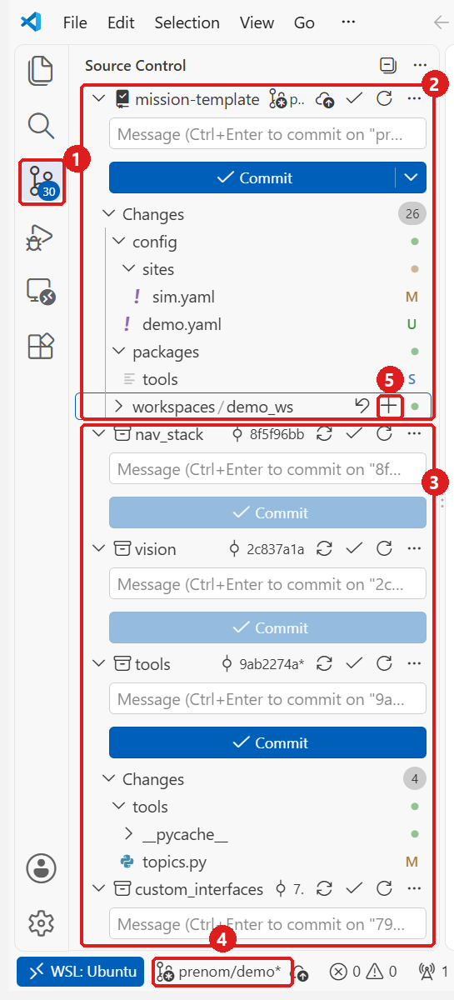
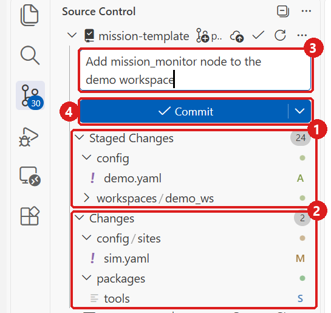
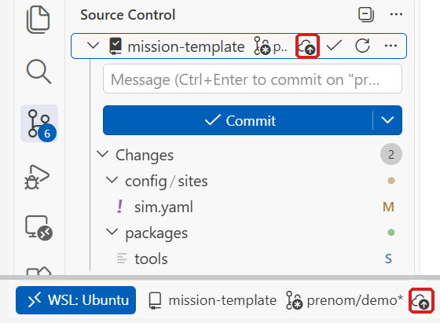
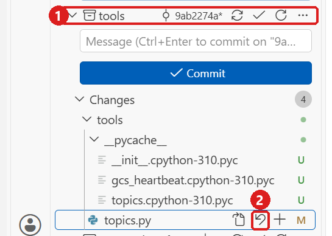

# Formation 5.3 : projet, ajouter une node à la démo

## Objectifs de la formation

À la fin de cette partie, vous serez capable de :

- Ajouter une node à un workspace de mission en respectant les règles de code du repo
- Déclarer un nouveau topic au bon endroit, et le rendre externe ou interne en le nommant
- Donner des réglages à votre node sans écrire une valeur dans le code
- Passer `make check`, ouvrir une PR et la faire relire

Prérequis : la [formation 5.2](5.2-une-mission-en-simulation.md) terminée (la démo tourne en simulation, la machine à états passe par ses quatre états, le waypoint vient d'un YAML que vous avez modifié).

Jusqu'ici vous avez habité le repo. Ici vous y ajoutez quelque chose. La node demandée est petite et volontairement inoffensive, parce que ce n'est pas elle qui est difficile. Ce qui compte, ce sont les cinq points de contact d'une node avec le repo, qu'elle oblige tous à toucher : un package, un `package.xml`, une constante dans `topics.py`, un launch file, la config.

> [!NOTE]
> **Avant de commencer**
> - **Durée** : environ 2 h, dont un quart d'heure de rappel git.
> - **Prérequis** : 5.2 faite : la démo se lance avec `make sim C=demo`.
> - **À la fin** : une PR ouverte sur le repo template, et `make check` qui ne dit plus rien sur votre package.
> - **Aide** : Discord, salon Contrôle, fil « Formations et Questions », avec le message d'erreur exact.
> - **À poster à la fin** : le lien de votre PR, et une capture du nouveau topic vu depuis un second terminal.

Rappel de 5.1 et 5.2 : le shell ouvert par `make shell` est déjà sourcé. ROS 2 et le workspace du dossier courant sont chargés à l'ouverture, donc `ros2 topic list` répond tout de suite, sans rien taper avant.

---

## 1 - Le cahier des charges

Une node `mission_monitor`, dans un package `demo_monitor`, qui écoute l'état de la mission et `/mavros/battery` (deux subscribers), et publie un résumé sur un topic externe à 1 Hz : l'état courant, la tension, le temps passé dans l'état. Elle n'arme rien, ne commande rien, elle regarde.

Le résumé est un `std_msgs/String` qui contient du JSON sur une ligne :

```json
{"state": "GOTO", "voltage": 15.8, "time_in_state": 12.4}
```

L'énoncé complet, la liste des fichiers à toucher et la grille que le lead utilisera pour relire votre PR sont dans [`5.3-projet/README.md`](5.3-projet/README.md). Lisez-le en entier avant d'écrire une ligne : il est votre cahier des charges, ce document est votre mode d'emploi.

---

## 2 - Le squelette et les règles

### 2.1 - Copier le squelette

Le squelette est fourni, comme celui de `keyboard_control` en formation 3.4 (section 3.3). Depuis la racine de votre clone du template, le dossier `mission-template`, en remplaçant `<dossier de la formation>` par le chemin de votre clone de Formations-Controle (`~/Formations-Controle` si vous avez suivi la formation 2) :

```bash
cp -r <dossier de la formation>/5-env_compétition/5.3-projet/squelette/demo_monitor workspaces/demo_ws/src/
```

Le package se pose à côté de `demo_bringup` et `demo_mission`, dans le même `src/` : la règle de `packages/README.md` dit qu'un package est local à sa mission sauf s'il sert ailleurs, et celui-ci ne sert qu'ici. C'est un vrai dossier de votre workspace, pas un lien vers `packages/` : il n'y a donc pas de `make link` à faire, et `colcon` le trouve parce qu'il est dans `src/`.

```bash
make build C=demo
```

`make build C=demo` réussit : le package compile tel quel. Il n'y a rien à observer de plus pour l'instant, la node n'est pas encore dans le launch file et `topics.DEMO_SUMMARY` n'existe pas encore : lancée maintenant, elle s'arrêterait dès le démarrage sur une `AttributeError` (section 5). Il reste six `# TODO n :`, tous dans `demo_monitor/demo_monitor/monitor.py`.

### 2.2 - Les six TODO

Ouvrez `workspaces/demo_ws/src/demo_monitor/demo_monitor/monitor.py`. Les imports, la classe, le paramètre, les deux subscribers, le publisher et le timer sont écrits. Les six trous sont à quatre endroits :

| TODO | Où | Ce qui manque |
|---|---|---|
| 1 | `format_summary` | Le dictionnaire des trois champs, rendu en JSON |
| 2 et 3 | `state_callback` | Loguer la transition, retenir l'état et le temps reçu |
| 4 et 5 | `battery_callback` | Retenir la tension, avertir une fois sous le seuil |
| 6 | `tick` | Publier le résumé |

Deux callbacks qui ne font que retenir, un timer qui publie, une fonction de mise en forme qui ne connaît pas ROS. Cette dernière, `format_summary`, est une fonction de module et pas une méthode : elle n'appelle rien de ROS, donc elle se vérifie seule dans `python3`, sans lancer de node. Seule contrainte : le fichier importe `rclpy` en tête, donc l'essai se fait dans `make shell`, pas directement dans WSL (section 3.4).

Lisez d'abord les six règles de la section 2.3, puis écrivez les six TODO. Les sections 2.4 et 3 branchent ensuite la node au reste du repo.

### 2.3 - Les six règles, et la ligne qui les respecte

**Six règles de code**, celles que cette node rencontre, chacune avec l'endroit du squelette ou de la solution où elle se voit. Elles viennent d'`ARCHITECTURE.md` : les règles 1 à 4 et 6 de la section « Règles de code », la règle 5 des sections « Cinq mots à connaître » (le namespace de topics) et « Ce qui traverse la radio ».

**1. Le nom du topic vient de `topics.py`**, jamais d'une chaîne écrite dans la node : ligne 62 du squelette, `self.create_publisher(String, topics.DEMO_SUMMARY, 10)`, et la ligne à ajouter dans `topics.py` est `DEMO_SUMMARY = f'{EXTERNAL}/demo/summary'`. `/mavros/battery` est l'exception que prévoit `ARCHITECTURE.md` : mavros est un package tiers, donc ses topics deviennent des constantes en tête de la node qui les utilise, ici ligne 24 du squelette. `topics.py` ne décrit que les topics `/aeac` écrits par l'équipe.

**2. L'état se compare à une constante de `MissionState`**, jamais à `'IDLE'` ni à `0` : le dict `LABELS` est indexé par `MissionState.IDLE`, `.GOTO`, `.ACT` et `.RETURN`, lignes 26 et 27 du squelette, et c'est le seul endroit du fichier où les noms d'états apparaissent en texte. Dans `state_callback`, la transition se repère en comparant `msg.state` à l'état retenu, jamais à une chaîne.

**3. Pas de `time.sleep` dans un callback**, parce que pendant un `sleep`, aucun autre callback de la node ne tourne : ligne 64 du squelette, `self.timer = self.create_timer(1.0, self.tick)`.

**4. `package.xml` déclare ce qui est importé**, sinon la node marche chez celui qui l'a écrite et casse au premier clone propre : les cinq `<depend>` du squelette, `rclpy`, `std_msgs`, `sensor_msgs`, `tools` et `custom_interfaces`. Notez `sensor_msgs` et non `mavros_msgs` pour `BatteryState` ; vérifiez-le avec `ros2 interface show sensor_msgs/msg/BatteryState`.

**5. Le résumé est externe parce que le sol veut le voir**, et le préfixe suffit : `DEMO_SUMMARY` est construit à partir de `EXTERNAL`, donc le topic traverse la radio, alors qu'un topic sous `INTERNAL` reste sur la machine. La formation 6, à venir, montrera ce qui se passe derrière, du côté de Zenoh.

**6. Logs en français, `INFO` pour les événements, jamais du périodique**, parce qu'un log à chaque tour de timer rend le journal inutilisable le soir d'un vol raté : TODO 2 (ligne 71 du squelette), un `INFO` par transition d'état ; TODO 5 (ligne 80), un `WARN` au passage sous `battery_warn_v`, une seule fois par lancement ; rien dans `tick()`.

### 2.4 - `topics.py` est dans un submodule

`packages/tools` n'est pas un dossier du repo de mission : c'est un autre repo, attaché ici comme submodule. Dans la vraie vie, ajouter `DEMO_SUMMARY` veut donc dire ouvrir une PR dans le repo `tools`, la faire relire, puis avancer le pointeur du repo de mission avec `make bump PKG=tools`. Cette cible suit la branche que `.gitmodules` indique pour `tools` (`aeac-2027` aujourd'hui, pas `main`), et refuse de faire reculer le pointeur. C'est lent exprès : un nom de topic est une frontière entre les équipes.

Pour la formation, vous ne faites pas cette PR. Ouvrez `packages/tools/tools/topics.py` et ajoutez, sous `DEMO_STATE` :

```python
DEMO_SUMMARY = f'{EXTERNAL}/demo/summary'
```

`make status` dira alors que `tools` est modifié localement :

```bash
make status
```

Extrait de la sortie, les lignes qui vous concernent :

```
Branche : prenom/demo
Submodules (espace = à jour, + = commit différent du pointeur, - = non initialisé) :
 9ab2274ab96d2e2f4829baa2691c71466bf526b1 packages/tools (heads/aeac-2027)
 m packages/tools
```

Le texte entre parenthèses (`heads/aeac-2027`) peut être différent chez vous ; l'identifiant de commit est le même dans tous les clones.

La ligne des submodules reste à jour : le commit pointé n'a pas bougé, seul son contenu a changé. C'est le `git status` du bas de `make status` qui le dit, avec ` m packages/tools` : un `m` minuscule veut dire « contenu modifié, pointeur inchangé ». Un `M` majuscule voudrait dire que le commit du submodule lui-même a changé.

C'est attendu, et c'est la seule fois de la formation où on l'accepte. La règle de 5.1 reste la règle : un submodule modifié localement se signale à un lead avant d'aller plus loin. Ici le lead, c'est nous, et la réponse est écrite d'avance : gardez la modification locale, ne la mettez dans aucun commit, et décrivez la ligne dans votre PR pour que le lead la porte dans `tools`. La section 4 dit comment la tenir hors de votre commit.

---

## 3 - Brancher et vérifier

### 3.1 - Le launch file

Le moniteur doit démarrer et s'arrêter avec la mission : personne ne doit avoir à penser à le lancer. Il devient donc une seconde `Node` dans le launch file de la démo. Ouvrez `workspaces/demo_ws/src/demo_bringup/launch/mission.launch.py`. Le fichier est plat : il déclare ses arguments, construit la `Node` de la mission dans une variable, puis ajoute chaque action à la `LaunchDescription`. Vous faites la même chose pour le moniteur.

Après la `Node` `mission`, ajoutez :

```python
    monitor = Node(
        package='demo_monitor',
        executable='monitor',
        name='mission_monitor',
        output='screen',
        parameters=[f'{CONFIG_DIR}/demo.yaml'],
    )
```

Puis, sous les trois `ld.add_action` de la fin :

```python
    ld.add_action(monitor)
```

Une `Node` construite mais jamais passée à `ld.add_action` ne se lance pas, et rien ne vous le dira.

Le launch file de `demo_bringup` lance maintenant une node de `demo_monitor` : `demo_bringup` en dépend, et cela s'écrit dans son `package.xml`, qui est le contrat (règle 4 vue de l'autre côté). Ouvrez `workspaces/demo_ws/src/demo_bringup/package.xml` et ajoutez, sous `<exec_depend>demo_mission</exec_depend>` :

```xml
  <exec_depend>demo_monitor</exec_depend>
```

`exec_depend` et non `depend` : `demo_bringup` n'importe rien de `demo_monitor`, il le lance, exactement comme `demo_mission`.

Le moniteur reçoit `config/demo.yaml` tel quel, le même fichier que la node de mission. Il ne reçoit pas les paramètres du site : il ne vole pas, il regarde.

### 3.2 - La config, et le piège du fichier de paramètres

Un fichier de paramètres ROS 2 est indexé par nom de node : le premier niveau du YAML est le nom de la node qui recevra les clés qui suivent. `config/demo.yaml` commence par `demo_mission:`, donc une node nommée `mission_monitor` n'y lit rien, et elle n'y lit rien silencieusement, sans erreur ni avertissement, en gardant les défauts écrits dans son code.

Le moniteur a donc sa propre section dans le même fichier. Ouvrez `config/demo.yaml` à la racine du clone, et ajoutez à la fin :

```yaml
mission_monitor:
  ros__parameters:
    battery_warn_v: 14.0     # tension sous laquelle le moniteur avertit une fois, volts
```

C'est le cinquième point de contact du projet, « la config », et le seul qui ne se voit pas dans le code. Le seuil n'est écrit nulle part dans la node autrement que comme valeur par défaut de déclaration, ligne 48 du squelette : ce qui fait foi est dans `config/`.

Attention à l'endroit : `config/demo.yaml` à la racine du clone est celui que le launch file lit, sous le nom `/aeac/config/demo.yaml`. Le fichier de même nom dans `workspaces/demo_ws/src/demo_bringup/config/` est la copie d'origine du workspace, et modifier celui-là ne change rien à ce qui se lance. C'est le piège des deux copies de `demo.yaml` que vous avez posées au début de 5.2.

### 3.3 - Construire et lancer

Lancez le SITL dans Mission Planner, comme en 5.2 : sans lui, mavros n'a personne à qui parler et vous n'aurez jamais de tension. Puis, dans le terminal 1 (`Ctrl-C` d'abord si une démo tourne encore) :

```bash
make build C=demo
```

```bash
make sim C=demo
```

Parmi les lignes de la mission, celles du moniteur, avec la solution :

```
[monitor-2] [INFO] [mission_monitor]: Surveillance de la mission démarrée : résumé sur /aeac/external/demo/summary, alerte sous 14.0 V.
[monitor-2] [INFO] [mission_monitor]: État INCONNU -> IDLE
[monitor-2] [WARN] [mission_monitor]: Batterie sous le seuil : 12.59 V (seuil 14.0 V)
```

Dans les sorties de log de ce document, l'horodatage que ROS 2 Humble met après le niveau (`[INFO] [<secondes>.<nanosecondes>] [mission_monitor]: ...`) est omis. Les deux dernières lignes peuvent sortir dans l'autre ordre, et la tension exacte dépend du SITL.

Le `WARN` de batterie sort dès la première tension reçue, et c'est normal : le SITL simule une batterie d'environ 12.6 V, alors que le seuil de 14.0 V est réglé pour la batterie du drone. Le moniteur fait son travail : la tension qu'il reçoit est sous le seuil. La section 3.4 s'en sert pour vérifier que le seuil vient bien du YAML.

Encore faut-il que la tension arrive. C'est la leçon de la formation 3.3, section 3 : ArduPilot n'envoie sur la liaison de mavros que les messages qu'on lui demande, et avec le SITL de Mission Planner personne ne demande la batterie. Sans rien faire, le `WARN` ne sort donc pas et `voltage` reste à `null` dans le résumé (section 3.4). Depuis un second terminal ouvert avec `make shell`, demandez le message `SYS_STATUS` (identifiant 1), celui qui alimente `/mavros/battery` :

```bash
ros2 service call /mavros/set_message_interval mavros_msgs/srv/MessageInterval "{message_id: 1, message_rate: 1.0}"
```

Le `WARN` sort dans le premier terminal une seconde plus tard. Comme en 3.3, la demande est à refaire après chaque redémarrage du SITL.

### 3.4 - Le topic dans un second terminal

Dans un second terminal (celui de la section 3.3 s'il est déjà ouvert, sinon) :

```bash
make shell
```

`make shell` sans rien : la cible trouve toute seule le conteneur en cours, et le shell qu'elle ouvre est déjà sourcé. La node et son topic n'existent que maintenant, une fois le launch file modifié et `DEMO_SUMMARY` ajouté dans `topics.py` :

```bash
ros2 node list | grep monitor          # /mission_monitor
```

```bash
ros2 topic list | grep summary         # /aeac/external/demo/summary
```

```bash
ros2 topic echo --once /aeac/external/demo/summary
```

```
data: '{"state": "IDLE", "voltage": 12.59, "time_in_state": 3.4}'
---
```

`12.59` est la batterie du SITL, pas celle du drone : l'exemple du cahier des charges, `15.8`, est celui d'une batterie de drone.

La mise en forme se vérifie aussi seule, sans passer par le topic. Dans le même terminal :

```bash
python3 -c "from demo_monitor.monitor import format_summary; print(format_summary(1, None, 2.36))"
```

```
{"state": "GOTO", "voltage": null, "time_in_state": 2.4}
```

`1` est la valeur de `MissionState.GOTO`, et une tension pas encore reçue doit donner `null`, pas `0.0`.

Et la preuve que le seuil vient du YAML et pas du code :

```bash
ros2 param get /mission_monitor battery_warn_v
```

```
Double value is: 14.0
```

Ce `14.0` ne prouve rien tout seul, puisque c'est aussi le défaut écrit dans le code. Changez la valeur du YAML pour `11.0`, sous la tension du SITL (qui baisse doucement pendant le vol, sans descendre sous 11 V en une séance), puis `Ctrl-C` et `make sim C=demo` dans le premier terminal. Deux choses doivent changer : le `WARN` de batterie ne sort plus, et `ros2 param get` renvoie `11.0`. Si le `WARN` est toujours là et que le paramètre reste à `14.0`, votre section n'est pas lue : relisez la section 3.2. Remettez ensuite `14.0`, la valeur que votre PR propose.

<!-- capture : ros2 topic echo --once du résumé dans le second terminal, avec make sim qui tourne dans le premier -->

> [!TIP]
> **Jalon** : le résumé sort à 1 Hz, il passe de `IDLE` à `GOTO` quand vous donnez le GO (comme en 5.2 : `make takeoff`, puis `make rc` et la touche `w`, dans un troisième terminal ; si le drone est encore en l'air en GUIDED depuis 5.2, sautez `make takeoff`), et `ros2 param get` renvoie la valeur que vous avez écrite dans `config/demo.yaml`. Cette capture est celle que vous postez.

### 3.5 - `make check`

`make check` lit le repo et sort une ligne par problème, au format `chemin: message`. Lancez-le depuis la racine du clone, dans WSL, hors conteneur :

```bash
make check
```

```
workspaces/demo_ws/src/demo_monitor/package.xml: mainteneur à remplir
workspaces/demo_ws/src/demo_monitor/package.xml: licence à remplir (Apache-2.0)
workspaces/demo_ws/src/demo_monitor/package.xml: description à remplir
```

Trois lignes, toutes à vous : le reste du repo passe déjà, et sur un clone neuf `make check` répond `check : rien à signaler`. Les submodules ne sont pas vérifiés ici, parce qu'un défaut chez eux se corrige dans leur propre repo, pas dans votre PR. `make` affiche aussi, au-dessus, la commande qu'il lance (`python3 scripts/check.py`) et, comme `check.py` sort en erreur, sa propre ligne `make: *** ... Error 1` en dessous.

Ces trois lignes sont l'exercice. Le squelette est livré avec les trois champs que `ros2 pkg create` laisse en place. Ils comptent : un mainteneur `root@todo.todo` ne dit à personne à qui demander quand un bug sort six mois plus tard. Ouvrez `workspaces/demo_ws/src/demo_monitor/package.xml` et remplissez :

- `<maintainer email="...">` : votre nom et un courriel où on peut vous joindre.
- `<license>` : `Apache-2.0`, comme le reste du repo.
- `<description>` : une phrase qui dit ce que le package fait.

Puis les mêmes champs dans `setup.py` : `maintainer`, `maintainer_email`, `description`, `license`. `check.py` ne regarde pas `setup.py`, et ce n'est pas parce que l'outil ne le voit pas que c'est fini. Le lead, lui, le regarde.

`make check` doit ensuite répondre `check : rien à signaler`.

---

## 4 - Rappel git, puis branche et PR

Un quart d'heure. Git a été vu en formation 0, section 3, au terminal : un commit, un push, un clone. Ici, vous faites la même chose dans VS Code, avec le panneau **Source Control**, qui montre ce que vous allez envoyer avant que vous l'envoyiez. Les mêmes étapes au terminal sont à la fin de la section (4.5).

Trois règles, et rien d'autre :

1. Une branche par tâche. `main` ne reçoit jamais de push direct, ni ici ni dans le repo de compétition.
2. Un message de commit en anglais, sur une ligne, qui dit ce que le commit change.
3. `make check` avant d'ouvrir la PR.

### 4.1 - Le panneau Source Control

Dans la fenêtre VS Code ouverte sur votre clone (`WSL: Ubuntu` en bas à gauche, comme en formation 2), ouvrez le panneau Source Control : l'icône des branches dans la barre de gauche, ou `Ctrl+Shift+G`. Pour voir des dossiers plutôt qu'une longue liste de fichiers : `...` en haut du panneau, **View & Sort**, **View as Tree**. Les captures sont prises dans ce mode.



1. Le panneau. Le nombre compte les fichiers modifiés, tous repos confondus.
2. Le bloc `mission-template` : votre repo, le seul où vous committez. `U` veut dire nouveau fichier que git ne suit pas encore, `M` modifié, `S` submodule dont le contenu a changé : c'est la ligne `packages/tools` de la section 2.4.
3. Un bloc par submodule : `nav_stack`, `vision`, `tools`, `custom_interfaces`, et la suite plus bas. VS Code les montre parce que ce sont des repos à part entière. Vous n'y touchez pas : ni **+**, ni **Commit**, même quand le bouton est bleu. Le bloc `tools` montre votre `topics.py` modifié et des `__pycache__` laissés par le build : c'est normal, laissez-les.
4. La branche courante. Vous êtes toujours sur `prenom/demo`, la branche de 5.2, et c'est elle que vous envoyez sur GitHub : la démo et le moniteur forment une seule tâche, donc une seule branche, et le commit contient aussi la démo. Le préfixe `prenom/` dit à qui parler. L'astérisque signale des modifications pas encore committées.
5. Le **+** (*Stage Changes*), qui apparaît quand la souris passe sur une ligne : section 4.2.

### 4.2 - Choisir ce qui entre dans le commit, puis committer

On nomme ce qui entre dans le commit, on ne prend jamais tout. Dans le bloc `mission-template`, cliquez le **+** de deux lignes, et de deux seulement :

- `workspaces/demo_ws` : le **+** d'un dossier stage tout ce qu'il contient, soit les packages `demo_bringup` (avec son launch file et son `package.xml` modifiés), `demo_mission` et votre `demo_monitor`, plus les trois liens livrés avec la démo ;
- `config/demo.yaml`.

Pas `config/sites/sim.yaml` : modifié en 5.2, il ne fait pas partie de cette PR. Pas `packages/tools` : le commit du submodule n'a pas changé, seul son contenu, donc il n'y a rien à stager (section 2.4). Et jamais le **+** de la ligne **Changes** elle-même, qui stage tout d'un coup : c'est le `git add -A` du terminal.



1. **Staged Changes** : ce qui entrera dans le commit. `A` veut dire ajouté. Un fichier stagé par erreur en ressort avec le **−** de sa ligne.
2. **Changes** : ce qui reste hors du commit, `sim.yaml` et `tools`. C'est voulu.
3. Le message : en anglais, sur une ligne, au présent, par exemple `Add mission_monitor node to the demo workspace`.
4. **Commit**.

Si VS Code demande s'il doit stager tous vos changements et committer directement, c'est que **Staged Changes** est vide : refusez, et reprenez les **+**. Accepter mettrait `sim.yaml` dans le commit.

Pas de commit dans le bloc d'un submodule non plus : le pointeur viserait alors un commit qui n'existe que chez vous, et le clone suivant échouerait.

### 4.3 - Envoyer la branche et ouvrir la PR

Après le commit, le bloc `mission-template` ne montre plus que `sim.yaml` et `tools`. La branche n'existe encore que sur votre machine : cliquez le nuage à flèche (*Publish Branch*), en haut du bloc ou à côté du nom de la branche, en bas.



VS Code crée la branche sur GitHub et retient le lien entre les deux : les commits suivants partent avec **Sync Changes**, au même endroit. Si VS Code demande de vous connecter à GitHub, acceptez : il ouvre le navigateur pour le faire.

Ouvrez ensuite `https://github.com/zenith-polymtl/mission-template` dans le navigateur : GitHub propose votre branche en haut de la page, avec un bouton **Compare & pull request**. La description de la PR dit ce que la node fait, et surtout elle contient la ligne de `topics.py` qui n'est pas dans votre commit :

```
tools/topics.py : DEMO_SUMMARY = f'{EXTERNAL}/demo/summary'
```

C'est ce que le lead portera dans le repo `tools`.

Le lead relit ensuite avec la grille de [`5.3-projet/solution/CHECKLIST.md`](5.3-projet/solution/CHECKLIST.md) : six règles de code, et ce qui se vérifie autour. Elle est publique, vous pouvez la lire avant de déposer votre PR, et c'est même une bonne idée. La PR n'est pas un examen, c'est le prétexte à la conversation.

Cette PR est ouverte sur le repo template lui-même, et elle n'y sera pas mergée : le lead la relit, la ferme sans merge, puis supprime la branche, parce que le template ne contient jamais de mission. Ce qui reste de votre travail est la conversation de la PR, et la ligne de `topics.py` que le lead porte dans le repo `tools`.

### 4.4 - Après la PR : rendre `tools` propre

Une fois la PR fermée, rendez à `tools` son état d'origine, pour que `make status` ne signale plus de submodule modifié. Dans le bloc `tools`, passez la souris sur `topics.py` et cliquez la flèche courbe (*Discard Changes*), puis confirmez.



1. Le bloc du submodule `tools`, pas celui de `mission-template`.
2. *Discard Changes* : `topics.py` revient à la version du pointeur. Les `__pycache__` peuvent rester.

### 4.5 - Les mêmes étapes au terminal

Pour ceux qui préfèrent le terminal, depuis la racine du clone dans WSL :

```bash
git status                     # ce que git voit, dont packages/tools (modified content)
git add workspaces/demo_ws config/demo.yaml
git status --short             # A = stagé ; " M" sim.yaml et " m" packages/tools restent dehors
git commit -m "Add mission_monitor node to the demo workspace"
git push -u origin prenom/demo # -u retient le lien : les git push suivants n'ont plus besoin d'arguments
```

Et une fois la PR fermée :

```bash
git -C packages/tools restore tools/topics.py
```

---

## 5 - Quand ça casse

| Ce que vous voyez | Pourquoi | Quoi faire |
|---|---|---|
| `package 'demo_monitor' not found` au lancement de `make sim` | Le workspace n'a pas été reconstruit depuis la copie du squelette | `make build C=demo`, puis relancer `make sim C=demo` |
| `AttributeError: module 'tools.topics' has no attribute 'DEMO_SUMMARY'` | La node utilise `topics.DEMO_SUMMARY` dès son démarrage, et la ligne n'est pas encore dans `packages/tools/tools/topics.py` | Section 2.4, puis relancer `make sim C=demo` |
| `ModuleNotFoundError: No module named 'tools'` | Le lien `tools` de `demo_ws/src` est cassé, ou le terminal n'a pas été ouvert avec `make shell` et n'est pas sourcé | `ls -l workspaces/demo_ws/src` : `tools` doit porter une flèche (un lien copié depuis Windows devient un fichier texte, 5.2) ; ouvrir le terminal avec `make shell` |
| `make check` rouge sur le `package.xml` de `demo_monitor` | Les trois métadonnées que le squelette laisse vides | Les remplir, c'est l'exercice (section 3.5) |
| `voltage` reste à `null` dans le résumé | mavros ne reçoit pas la batterie, parce qu'ArduPilot n'envoie que les messages demandés ; ou le TODO 4 ne retient pas la tension | `ros2 topic hz /mavros/battery` : s'il n'affiche rien, la demande `set_message_interval` de la section 3.3 ; sinon relire `battery_callback` |
| Le topic apparaît dans `ros2 topic list` mais `ros2 topic echo` n'affiche rien | Le TODO 6 n'est pas écrit : la node crée son publisher et ne publie jamais | Relire `tick()` |
| `ros2 node list` ne montre pas `/mission_monitor` | La `Node` est construite mais pas ajoutée : `ld.add_action(monitor)` manque | Section 3.1 |
| Le topic ne s'appelle pas `/aeac/external/demo/summary` | Un nom de topic écrit en clair dans la node au lieu de `topics.DEMO_SUMMARY` | `grep -rnE "['\"]/aeac" workspaces/demo_ws/src/demo_monitor` : une chaîne qui commence par `/aeac` ne doit apparaître nulle part |
| Le commit contient `sim.yaml`, ou tout le repo | La ligne **Changes** a été stagée en entier, ou VS Code a eu le droit de tout stager | Avant de publier : `...` du bloc `mission-template`, **Commit**, **Undo Last Commit**. Les fichiers reviennent dans **Staged Changes** : sortir `sim.yaml` avec le **−**, puis recommitter (section 4.2) |
| *Publish Branch* ou `git push` refusé (`Permission denied` ou erreur 403) | Votre compte GitHub n'est pas encore membre de l'organisation `zenith-polymtl` ou de l'équipe contrôle | Demander à un lead de vous y ajouter (5.1, « Avant de commencer »), puis refaire *Publish Branch* |
| `ros2 param get` renvoie `14.0` alors que le YAML dit autre chose | Les clés sont sous `demo_mission:` au lieu d'une section `mission_monitor:`, ou c'est le mauvais `demo.yaml` qui a été modifié | Section 3.2 |

---

Suite : [Formation 5.5, pour plus tard](5.5-pour-plus-tard.md). Les leads lisent aussi [l'annexe 5.4](5.4-annexe-leads-creer-un-environnement.md).
