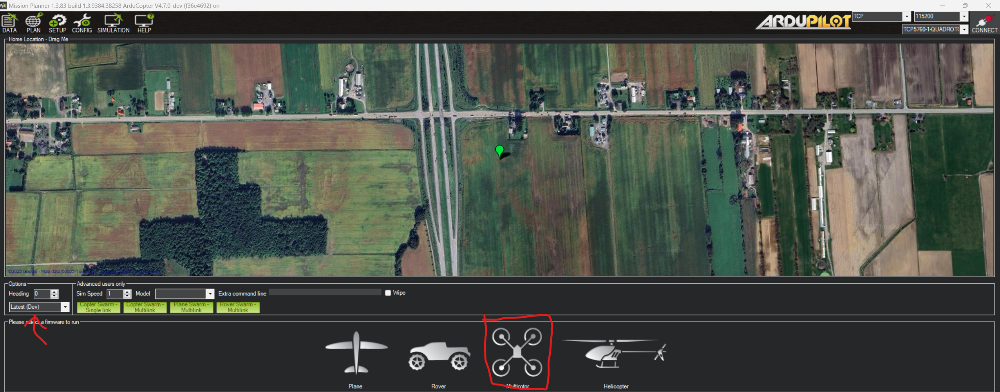
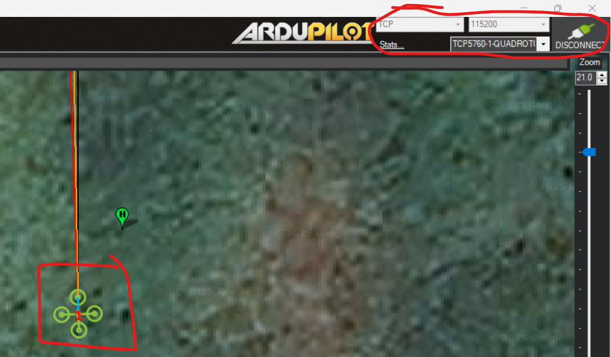
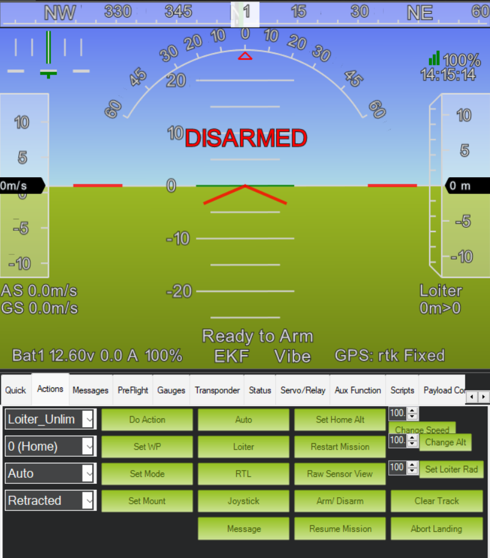
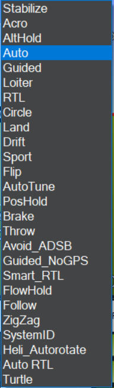
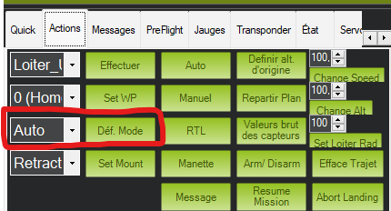

# Formation contrôle niveau 1 (B1)

## Objectifs de la formation

À la fin de cette formation, vous serez capable de :

- Installer Mission Planner et comprendre le rôle d'une GCS (ground control station)
- Lancer une simulation SITL directement depuis Mission Planner
- Contrôler un drone simulé via l'interface de Mission Planner (modes de vol, arm, takeoff, navigation)
- Comprendre ce qu'est MAVLink et pourquoi c'est le protocole central du contrôle autonome
- Écrire vos premiers scripts de mission en Python avec Zenmav

Aucune expérience préalable avec les drones n'est requise. Les bases de Python et de la programmation orientée objet (B0, section 4) servent à la section 3.

> [!NOTE]
> **Avant de commencer**
> - **Durée** : environ 2 h.
> - **Prérequis** : B0 fait. Python et Git installés (`python --version` répond dans un terminal).
> - **À la fin** : le drone simulé décolle, suit vos waypoints et revient se poser, commandé par votre script.
> - **Aide** : Discord, salon Contrôle, fil « Formations et Questions », avec le message d'erreur exact.
> - **À poster à la fin** : une capture de Mission Planner avec le drone en vol pendant que votre script roule.

---

# 1. Mission Planner

Zenith utilise Mission Planner comme GCS (ground control station). Une GCS est le logiciel au sol qui communique avec l'autopilote du drone : elle permet de suivre la télémétrie* du véhicule en temps réel, de le configurer et de lui envoyer des commandes. D'autres logiciels existent, comme QGroundControl (Logiciel tout aussi valide), mais l'équipe a choisi Mission Planner.

*La **télémétrie** désigne le flux de données sur l'état du véhicule : position, vitesse, altitude, tension de la batterie, etc.

## 1.1 Installation

Installer Mission Planner en suivant les instructions de la documentation officielle :

<https://ardupilot.org/planner/docs/mission-planner-installation.html>

Mission Planner est un logiciel Windows, et la formation suppose Windows 11 (Windows 10 fonctionne aussi, avec une adresse réseau à adapter en B2).

<details>
<summary>Sous Linux et Mac</summary>

**Linux.** Mission Planner roule avec Mono, simulation intégrée comprise. Chemin testé dans l'équipe sous Ubuntu, repris de la [procédure officielle](https://ardupilot.org/planner/docs/mission-planner-installation.html) :

```bash
sudo apt install mono-complete unzip
mkdir -p ~/MissionPlanner && cd ~/MissionPlanner
wget https://firmware.ardupilot.org/Tools/MissionPlanner/MissionPlanner-latest.zip
unzip MissionPlanner-latest.zip
mono MissionPlanner.exe
```

Si les fenêtres s'affichent mal ou que la simulation refuse de démarrer, installer Mono depuis <https://www.mono-project.com/download/stable/> plutôt que depuis les dépôts d'Ubuntu, dont la version est plus vieille.

**Mac.** Il n'existe pas de version Mac utilisable : la doc officielle renvoie à une machine virtuelle Windows. L'équipe n'a pas de chemin testé. L'option à essayer est le [SITL sans Mission Planner](../ANNEXE-SITL-DOCKER.md), expérimental lui aussi.

</details>

Après l'installation, ouvrez Mission Planner. Les différents onglets se trouvent en haut à gauche :


- **Data** : visualiser l'état du drone en temps réel (carte, horizon artificiel, télémétrie) et lui envoyer des actions. C'est l'onglet principal en opération.
- **Plan** : préparer une mission « Auto » (suite de waypoints exécutée sans intervention). Peu utilisé en contrôle puisque nos missions autonomes passent par des scripts plutôt que par MP. Sert aussi à créer la geofence (barrière virtuelle qui délimite la zone de vol autorisée).
- **Setup** : configuration initiale, calibrations (accéléromètre, boussole, radio), failsafes, tests des moteurs et du reste du hardware.
- **Config** : accès aux paramètres du drone, geofence et tuning.
- **Simulation** : démarrage et gestion d'une simulation intégrée à MP. C'est la version la plus limitée des simulations disponibles avec ArduPilot, mais elle est suffisante pour bien des cas, dont cette formation.

## 1.2 Intro à la simulation MP

La simulation intégrée de Mission Planner lance en arrière-plan un SITL (Software In The Loop) : le vrai code de l'autopilote ArduPilot roule sur votre ordinateur, avec des capteurs et une physique simulés. Le drone simulé se comporte donc comme un vrai drone, ce qui permet de tester sans risque.

### Démarrer la simulation

Aller dans l'onglet **Simulation**, puis choisir **Multirotor** avec la version **Stable** :



Le choix de version se fait dans le menu déroulant en bas à gauche :

- **Stable** : dernière version officielle, c'est celle à utiliser
- **Beta** : version candidate en test
- **Dev** : version de développement, potentiellement instable
- **Skip download** : réutilise la version déjà installée, pratique quand on relance souvent la simulation

Une fois le véhicule choisi, MP télécharge le firmware, démarre le SITL et s'y connecte automatiquement. La connexion est visible en haut à droite :



> [!TIP]
> **Tu as réussi si** le coin supérieur droit affiche la connexion et que le HUD bouge (horizon artificiel, altitude, GPS).

Prenez un moment pour explorer les options de connexion en haut à droite (utilisées quand on se connecte manuellement à un véhicule) :

- **COM** : connexion série physique, par câble USB ou par module de télémétrie radio
- **TCP / UDP** : connexions réseau, utilisées entre autres pour les simulations et les liens WiFi
- **AUTO** : essaie de détecter tout seul, peu fiable, marche des fois

Le champ à côté du type de connexion est le **baudrate** : la vitesse de transmission d'un lien série, en bits par seconde (115200 est la valeur habituelle). Il n'a d'importance que pour les connexions COM; en TCP/UDP, il est ignoré.

## 1.3 Intro à la gestion MP de base

Aller dans l'onglet **Data**, puis choisir le sous-onglet **Actions** (sous l'horizon artificiel, en bas à gauche) pour pouvoir interagir avec le drone. Ce sous-onglet est le seul étudié dans cette formation.

Par défaut :



Remarquez au passage l'horizon artificiel (HUD) au-dessus : il affiche l'attitude du drone, son état (DISARMED / Ready to Arm), le mode de vol actif, la batterie et la qualité du GPS.

### Les modes de vol

À la troisième ligne du panneau Actions, le menu déroulant sert à changer le **mode de vol** du drone. Un mode de vol détermine comment l'autopilote interprète les commandes et quel niveau d'assistance il fournit. Il en existe énormément :



Documentation complète : <https://ardupilot.org/copter/docs/flight-modes.html>

Nous en utilisons principalement trois :

- **AltHold** est un mode manuel, assisté d'une stabilisation des angles et d'un contrôle de l'altitude. Aucun contrôle de position : sans commande du pilote, le drone dérive avec le vent.
- **Loiter** est un mode manuel fortement assisté : contrôle d'angle, de vitesse et de position. Sans commande du pilote, le drone tient sa position grâce au GPS. Seul le pilote contrôle le drone dans ce mode.
- **Guided** est un mode autonome qui permet le contrôle par une source de commandes externe (Raspberry Pi, ground station). C'est le mode utilisé par nos scripts autonomes. 

Pour cette formation, comme dans bien des simulations, nous allons passer en **Guided**. Choisir le mode dans le menu déroulant, puis cliquer sur **Set Mode** (« Déf. Mode » en français) juste à droite :



Autres boutons particulièrement utiles :

- **RTL** (Return To Launch) : le drone remonte à une altitude sécuritaire, revient au-dessus de son point de départ (« home ») et atterrit
- **Arm / Disarm** : arme ou désarme le drone. Armer autorise les moteurs à tourner (les hélices se mettent à tourner au ralenti); désarmer les coupe. Un drone ne peut décoller que s'il est armé.

## 1.4 Contrôle en Guided via MP
Lire toutes les étapes de la section 1.4 avant de commencer.

1. S'assurer d'être en mode **Guided**.
2. Armer le drone : cliquer sur le bouton **Arm / Disarm**.

   > [!WARNING]
   > Si le décollage n'est pas effectué dans les 15 secondes suivant l'armement, le drone se désarme automatiquement (mesure de sécurité) et il faudra recommencer.

3. Décoller : clic droit sur la carte → **Takeoff** → entrer l'altitude.
4. Naviguer : clic droit sur la carte → **Fly to here** → entrer l'altitude. Le drone se rend au point cliqué.
5. Atterrir : cliquer sur le bouton **RTL** pour que le drone revienne à son point « home » et atterrisse.

Amusez-vous un peu avec les commandes : enchaînez des Fly to here, changez d'altitude, observez la télémétrie dans le HUD.

> [!TIP]
> **Tu as réussi si** le drone a décollé, s'est rendu à un point cliqué et est revenu se poser avec RTL.

## 1.5 Gestion des paramètres

Le comportement de l'autopilote est entièrement défini par ses **paramètres** : environ 1000 valeurs configurables qui couvrent tout, du tuning des moteurs jusqu'aux limites de vitesse.

Pour les voir : onglet **Config** → **Full Parameter List**. On peut y chercher un paramètre par nom, modifier sa valeur, puis cliquer sur **Write Params** pour l'envoyer au drone.

Quelques exemples :

- `WPNAV_SPEED` : vitesse horizontale de navigation entre waypoints (en cm/s)
- `WPNAV_RADIUS` : rayon autour d'un waypoint à l'intérieur duquel il est considéré atteint
- `LAND_SPEED` : vitesse verticale de descente en fin d'atterrissage
- `SERIAL1_PROTOCOL` : protocole utilisé sur le port série 1 (MAVLink, GPS, etc.)

Liste complète : <https://ardupilot.org/copter/docs/parameters.html>

## 1.6 Défi

À faire, en simulation :

- Faire des recherches pour atteindre la plus haute vitesse possible (sans crash)
  - Indice : ça se passe dans les paramètres

ou

- Bonus : faire crasher le drone en simulation
  - Au moins 2 méthodes possibles

---

# 2. Environnement de développement

Pour la suite, il faut Python 3 avec pip et VS Code avec l'extension Python, installés en B0. Sous Windows, le script de la section 3 roule dans un terminal Windows (Git Bash ou PowerShell, depuis VS Code), pas dans WSL : c'est ce qui rend l'adresse `127.0.0.1` de la simulation valable telle quelle. WSL arrive en B2.

> [!NOTE]
> **Linux** : `sudo apt install python3-pip`, puis tout est identique. **Mac** : `brew install python`, ou l'installateur de <https://www.python.org/downloads/> ; le script roule dans le Terminal. Dans les deux cas, la simulation doit tourner sur la même machine (section 1.1).

---

# 3. MAVLink et scripts

**MAVLink** est un protocole de communication qui permet de dialoguer avec l'autopilote, soit pour recevoir des données (télémétrie), soit pour envoyer des commandes. La majorité des communications dédiées à l'autonomie d'un drone ou d'un VTOL passe par MAVLink.

En bref, tout est message. L'autopilote diffuse en continu des messages de télémétrie (position, attitude, batterie, un « heartbeat » qui confirme que le lien est vivant), et la station au sol ou le script répond avec des messages de commande :

```text
Script / GCS                          Autopilote
     |  <---- HEARTBEAT, position, batterie ...  |
     |  ----> commande (takeoff, goto, mode) --> |
     |  <---- accusé de réception (ACK) -------  |
```

C'est exactement ce que Mission Planner faisait pour nous à la section 1 : chaque clic sur la carte était traduit en message MAVLink. Écrire un script de contrôle, c'est envoyer ces mêmes messages nous-mêmes.

Pour en savoir plus : <https://ardupilot.org/dev/docs/mavlink-commands.html>

## 3.1 Intro au contrôle MAVLink

Il existe plusieurs interfaces logicielles pour parler MAVLink avec l'autopilote. L'équipe utilise Zenmav en simulation et pour débuter, et mavros en mission réelle (B2 et B3). pymavlink est montré ici pour comprendre ce que Zenmav cache.

- **pymavlink** : contrôle Python de base, bas niveau. On manipule les messages MAVLink directement.
- **Zenmav** : contrôle Python haut niveau, développé par Zenith par-dessus pymavlink.
- **mavros** : messages MAVLink exposés en ROS, agnostique du langage. Utilisé pour les systèmes plus complexes.
- **MAVSDK** : SDK officiel MAVLink, cœur en C++ (donc plus rapide) avec des bindings dans plusieurs langages.
- **DroneKit** : très utilisé avant, mais abandonné et plus maintenu. **NE PAS UTILISER.**

Documentation pymavlink :

- Officielle : <https://mavlink.io/en/mavgen_python/>
- DeepWiki (documentation générée, avec aide AI) : <https://deepwiki.com/ArduPilot/pymavlink>
- Exemples ArduPilot (moyennement utiles pour nous) : <https://github.com/ArduPilot/pymavlink/tree/master/examples>

Il est possible d'utiliser directement pymavlink pour faire des missions complexes, mais le code devient vite dense et manque de clarté et de structure.

Exemple d'un décollage en pymavlink :

```python
connection.mav.command_long_send(
    connection.target_system,
    connection.target_component,
    mavutil.mavlink.MAV_CMD_NAV_TAKEOFF,
    0,
    0,
    0,
    0,
    0,
    0,
    0,
    altitude,
)
```

Le problème de pymavlink : aucun feedback intégré. La commande est envoyée, mais rien ne confirme que le décollage a eu lieu ni qu'il est terminé. Il faut surveiller soi-même la télémétrie du drone pour en déduire son état.

Solution : utiliser les wrappers de Zenmav pour simplifier les commandes.

## 3.2 Installation de Zenmav

Zenmav s'installe avec pip (qui installera aussi pymavlink automatiquement) :

```bash
pip install zenmav
```

## 3.3 Zenmav

Zenmav est une librairie qui facilite le contrôle via MAVLink, en faisant abstraction des processus qui vérifient l'état du drone et de l'encodage binaire des paramètres des messages.

**Pourquoi?**

Dans la commande de décollage pymavlink montrée plus haut, le drone reçoit la commande et pourrait décoller, ou pas (failsafe). Aucune notification n'est émise lorsque le drone atteint l'altitude demandée; il est donc difficile de savoir quand passer à la prochaine étape d'une mission autonome.

À l'inverse, la fonction `Zenmav.takeoff(altitude)` envoie la commande de décollage, mesure la position du drone en continu et bloque le reste de l'exécution tant que l'altitude demandée n'est pas atteinte. Le script peut donc enchaîner les étapes en toute confiance :

```python
from zenmav.core import Zenmav

drone = Zenmav()            # connexion par défaut au SITL (tcp:127.0.0.1:5762)
drone.set_mode('GUIDED')
drone.arm()
drone.takeoff(altitude=10)  # bloque jusqu'à 10 m d'altitude
# ... suite de la mission
drone.RTL()                 # attend l'atterrissage et le désarmement
```

Zenmav est construit en POO (programmation orientée objet) : `Zenmav` est une classe dont les méthodes sont les commandes de contrôle, exactement la classe `Drone` de B0 section 4. Pour une mission qui dépend de la position, `drone.get_global_pos()` renvoie la latitude, la longitude et l'altitude relative du drone.

> [!WARNING]
> **En simulation, un script peut passer en GUIDED et armer le drone**, comme ci-dessus. **En vol réel et dans le code final de compétition, jamais** : le pilote arme et change de mode depuis la radiocommande, et le code agit seulement dans ce cadre. On y revient en B3.

> [!TIP]
> **Tu as réussi si** ce script fait décoller le drone à 10 m dans Mission Planner et le ramène avec RTL, sans que vous touchiez à MP.

Les fonctions principales : waypoints locaux et globaux, consignes de vitesse et de cap, décollage et RTL, lecture et écriture de paramètres, contrôle de gimbal. La liste complète, avec les signatures, est dans le README du dépôt : <https://github.com/zenith-polymtl/Zenmav>

Documentation et aide AI : <https://deepwiki.com/zenith-polymtl/Zenmav>

## 3.4 Défi

Écrire sa propre mission de A à Z avec Zenmav, et la faire rouler contre la simulation MP de la section 1!

Options de mission :

- Tracer un Z pour Zenith dans les airs
- Scanner un carré de 100 m par 100 m, dont le centre est situé à 150 m au nord et -50 m à l'est du point de décollage
- Votre propre mission fancy?

Conseils :

- Gardez la simulation MP ouverte pendant que votre script roule : la carte montre en direct ce que fait le drone, c'est le meilleur outil de débogage.
- Commencez simple (connexion, takeoff, un seul waypoint, RTL), puis ajoutez des étapes une à la fois.

> [!TIP]
> **Tu as réussi si** votre mission se déroule d'un bout à l'autre dans Mission Planner sans intervention. Poster la capture dans le fil Discord : c'est la fin de B1.

---

## 4. Quand ça casse

| Ce que tu vois | Pourquoi | Quoi faire |
|---|---|---|
| La simulation ne démarre pas, ou MP reste sur « téléchargement » | Le pare-feu ou l'antivirus bloque le SITL, ou le téléchargement du firmware a échoué | Autoriser Mission Planner dans le pare-feu Windows ; relancer avec **Skip download** si le firmware est déjà là (section 1.2) |
| Messages `PreArm: ...` dans le HUD, l'armement est refusé | Les vérifications pré-armement d'ArduPilot ne passent pas encore : le GPS simulé prend jusqu'à une minute pour converger | Attendre que le HUD affiche « Ready to Arm » (section 1.3), puis réessayer |
| Le drone s'arme puis se désarme tout seul | Pas de décollage dans les 15 secondes qui suivent l'armement | Armer et décoller sans attendre (section 1.4) |
| `pip : command not found` ou `python n'est pas reconnu` | Python n'est pas dans le PATH | Réinstaller Python en cochant **Add Python to PATH** (B0 section 1), ouvrir un nouveau terminal |
| Le script Zenmav reste bloqué sur la connexion | La simulation n'est pas démarrée, ou le script roule dans WSL sans mode Mirrored | Démarrer la simulation d'abord ; sous Windows, rouler le script dans un terminal Windows, pas dans WSL (section 2) |
| `Zenmav()` se connecte mais rien ne bouge dans MP | Le drone n'est pas en GUIDED ou n'est pas armé, ou l'altitude demandée est déjà atteinte | Regarder le mode et l'état dans le HUD ; `drone.set_mode('GUIDED')` et `drone.arm()` avant `takeoff` |

<details>
<summary>Notes pour l'encadrant</summary>

- **À vérifier avant de laisser continuer** : la connexion au SITL dans MP, un décollage et un RTL à la souris, un script Zenmav qui décolle. Sans ces trois-là, B2 n'a pas de simulation à brancher.
- **Où ça bloque** : le premier armement (PreArm, GPS pas prêt) ; Python installé dans WSL par réflexe alors que B1 le veut sous Windows ; le pare-feu au premier lancement du SITL.
- **Durée observée** : à remplir après la première cohorte.

</details>
